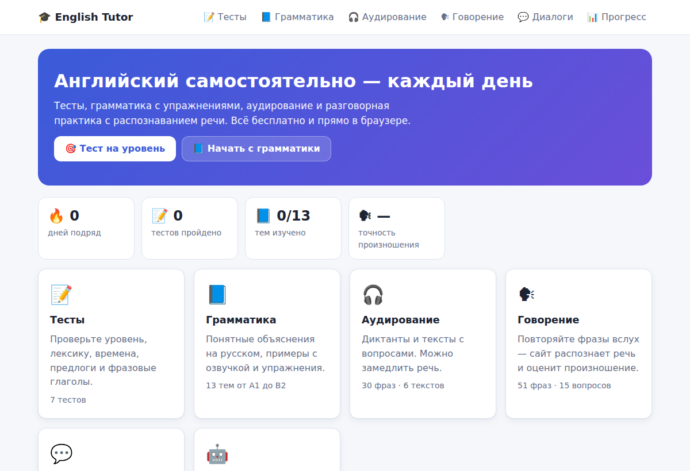
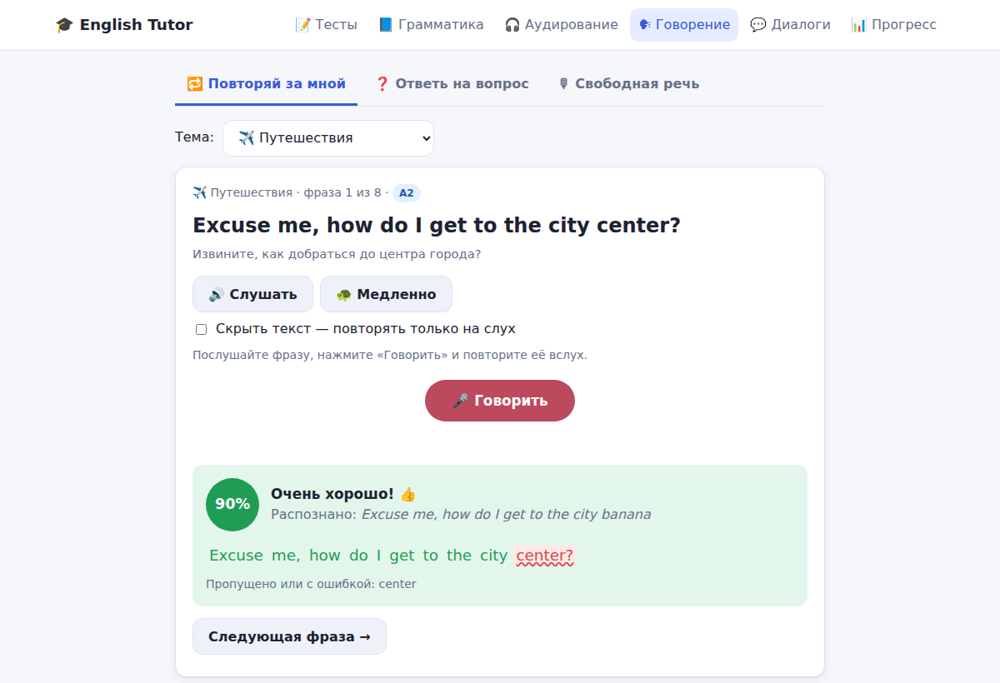
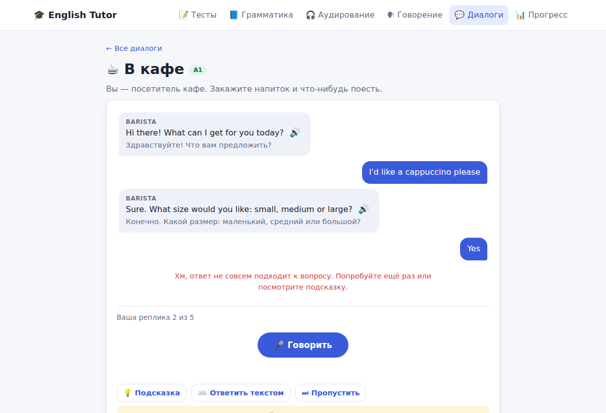
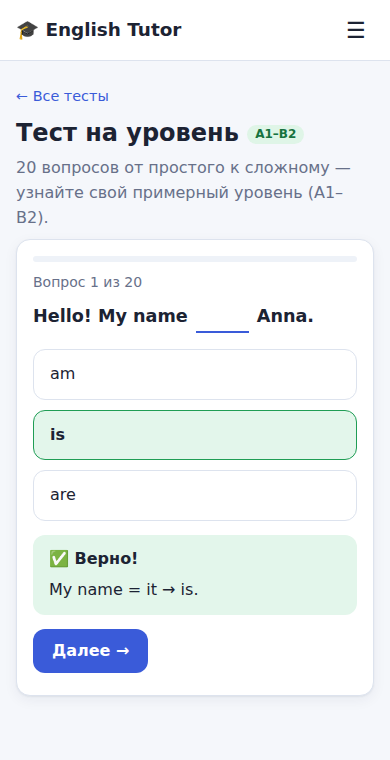

# 🎓 English Tutor

Сайт и Telegram-бот для самостоятельного изучения английского языка.
Оба работают на одном контенте и одной логике проверки ответов.

| | Сайт | Telegram-бот |
|---|---|---|
| 📝 **Тесты** — тест на уровень (A1–B2) и 6 тематических | ✅ | ✅ |
| 📘 **Грамматика** — 13 тем с объяснениями на русском, примерами с озвучкой и упражнениями | ✅ | ✅ |
| 🎧 **Аудирование** — диктанты (30 фраз, 4 уровня) и тексты с вопросами, замедленная речь | ✅ | ✅ голосовые сообщения |
| 🗣 **Говорение** — «повторяй за мной» с оценкой произношения, ответы на вопросы, свободная речь | ✅ микрофон | ✅ голосовые сообщения |
| 💬 **Диалоги** — 6 ролевых ситуаций (кафе, отель, врач, собеседование…) голосом или текстом | ✅ | ✅ |
| 📊 **Прогресс** — статистика, серия дней, уровень по тесту | ✅ в браузере | ✅ SQLite |

<p>
  
  
</p>
<p>
  
  
</p>

## Как это работает

**Озвучка (слушать).** На сайте используется встроенный синтезатор речи браузера (Web Speech API).
Если в браузере нет английского голоса, звук берётся с сервера (`/api/tts`, Google TTS через `gTTS`, с кэшем на диске).
Бот присылает голосовые сообщения, сгенерированные тем же серверным TTS.

**Распознавание речи (говорить).** На сайте — распознавание в браузере (Chrome, Edge, Safari).
Если браузер его не поддерживает, звук записывается с микрофона и отправляется на сервер (`/api/stt`).
Бот распознаёт голосовые сообщения на сервере. Серверное распознавание: `ffmpeg` переводит звук в WAV, затем
- `STT_BACKEND=google` — бесплатный Google Web Speech API (пакет `SpeechRecognition`, нужен интернет);
- `STT_BACKEND=whisper` — офлайн-распознавание [faster-whisper](https://github.com/SYSTRAN/faster-whisper) (`pip install faster-whisper`).

**Оценка ответов.** Тексты нормализуются: регистр, пунктуация, сокращения (`I'm` = `I am`, `doesn't` = `does not`),
цифры (`7` = `seven`), британское/американское написание. Произношение и диктант оцениваются по совпадению слов
(0–100%) с подсветкой пропущенных и ошибочных слов. В диалогах ответ засчитывается по ключевым словам
(«I'd like **a latte**» подходит к вопросу «What can I get for you?»).

## Быстрый старт

Нужны Python 3.10+ и `ffmpeg` (для распознавания голоса).

```bash
git clone https://github.com/osynskyi/english_tutor.git
cd english_tutor
python -m venv .venv && source .venv/bin/activate
pip install -r requirements.txt
cp .env.example .env          # впишите BOT_TOKEN для бота
```

**Сайт:**

```bash
python -m tutor.web           # http://localhost:8000
```

**Telegram-бот:**

1. Создайте бота у [@BotFather](https://t.me/BotFather) командой `/newbot` и скопируйте токен.
2. Впишите его в `.env`: `BOT_TOKEN=123456:ABC...`
3. Запустите:

```bash
python -m tutor.bot
```

Бот работает через long polling, поэтому публичный адрес и вебхуки не нужны.

### Docker

```bash
cp .env.example .env          # впишите BOT_TOKEN
docker compose up -d --build  # сайт на :8000 + бот
```

### Публикация сайта

Браузеры дают доступ к микрофону только по **HTTPS** (или на `localhost`).
Для публичного сайта поставьте перед ним обратный прокси с сертификатом, например [Caddy](https://caddyserver.com/):

```
english.example.com {
    reverse_proxy localhost:8000
}
```

## Настройки (`.env`)

| Переменная | По умолчанию | Описание |
|---|---|---|
| `BOT_TOKEN` | — | Токен Telegram-бота (обязателен для бота) |
| `BOT_USERNAME` | — | Имя бота без `@`: сайт покажет ссылку на бота |
| `SITE_URL` | — | Адрес сайта: бот покажет кнопку «Открыть сайт» |
| `WEB_HOST` / `WEB_PORT` | `0.0.0.0` / `8000` | Адрес и порт сайта |
| `STT_BACKEND` | `google` | Серверное распознавание речи: `google` или `whisper` |
| `WHISPER_MODEL` | `base.en` | Модель Whisper (`tiny.en`, `base.en`, `small.en`, …) |
| `TTS_TLD` | `com` | Акцент озвучки: `com` (US), `co.uk` (UK), `com.au` (AU) |
| `DATA_DIR` | `./data` | База прогресса бота и кэш озвучки |

## Структура проекта

```
tutor/
├── content/data/      # учебные материалы (JSON): grammar, tests, listening, speaking, dialogues
├── core/
│   ├── text.py        # нормализация текста (сокращения, числа, написание)
│   ├── scoring.py     # проверка ответов, диктантов, произношения, реплик диалога
│   ├── render.py      # теория → HTML для сайта и HTML для Telegram
│   └── speech.py      # TTS (gTTS + кэш) и STT (ffmpeg + Google / Whisper)
├── web/
│   ├── app.py         # FastAPI: JSON API + раздача сайта (документация API: /api/docs)
│   └── static/        # одностраничный сайт на чистом JS, без сборки
└── bot/
    ├── app.py         # сборка aiogram-диспетчера, запуск
    ├── storage.py     # прогресс пользователей в SQLite
    └── handlers/      # меню, тесты, грамматика, аудирование, говорение, диалоги, прогресс
tests/                 # pytest: ядро, API, речь, хранилище, сквозные тесты бота
```

## Как добавить свои материалы

Весь контент лежит в `tutor/content/data/*.json` — код менять не нужно.

- **Тема грамматики** (`grammar.json`): `theory` — блоки `h`, `p`, `rule`, `note`, `list`, `table`
  с разметкой `**жирный**`, `__курсив__`, `` `код` ``; `examples` — пары `en`/`ru`;
  `exercises` — вопросы `choice` (варианты + индекс ответа) или `input` (список допустимых ответов).
- **Тест** (`tests.json`): те же вопросы; поле `grading` задаёт уровень по числу верных ответов.
- **Диктант / текст** (`listening.json`), **фразы и вопросы** (`speaking.json`).
- **Диалог** (`dialogues.json`): реплики собеседника, подсказка, ключевые слова `expect`
  (любой вариант засчитывает ответ) и необязательный `min_words`.

После правок запустите тесты — они проверят структуру контента, что эталонные ответы проходят проверку,
а подсказки в диалогах засчитываются:

```bash
pip install -r requirements-dev.txt
pytest
```

## Разработка

```bash
pip install -r requirements-dev.txt
pytest                         # без сети и без настоящего Telegram
```

Сквозные тесты бота прогоняют апдейты через настоящий диспетчер aiogram, а вызовы Telegram API и речевые сервисы
подменяются заглушками.
